# ARCHITECTURE_GRAPH.md

> 本文件从 Monorepo 构建配置（pom.xml / settings.gradle / Makefile / package.json）自动梳理，不涉及具体业务代码。

## 1. 核心应用（Apps）与通用库（Libs）

### 核心库（Libs）

| 模块 | 路径 | 构建产物 | 说明 |
|------|------|----------|------|
| **zeze-java** | `ZezeJava/ZezeJava/` | `com.zezeno:zeze-java:1.6.3-SNAPSHOT.jar` | 核心框架：事务、缓存一致性、序列化、网络、数据库抽象、Raft |
| **zezecxx** | `cxx/` | `libzezecxx.a` | C++ 客户端静态库：ByteBuffer、网络、协议、加解密 |
| **zeze-ts** | `TypeScript/` | JS 输出 | TypeScript 客户端库：序列化、网络通信 |

### 应用（Apps）

| 模块 | 路径 | 构建产物 | 说明 |
|------|------|----------|------|
| **zezex-java-client** | `ZezeJava/ZezexJava/client/` | `zezex-java-client.jar` | Java 客户端 SDK |
| **zezex-java-linkd** | `ZezeJava/ZezexJava/linkd/` | `zezex-java-link.jar` | Linkd 连接负载均衡服务 |
| **zezex-java-server** | `ZezeJava/ZezexJava/server/` | `zezex-java-server.jar` | 游戏服务端示例（含多个 Demo Module） |
| **ZokerManager** | `ZezeJava/ZokerManager/` | Gradle 构建 | 进程管理器（依赖 zeze-java） |
| **zeze-java-test** | `ZezeJava/ZezeJavaTest/` | test jar | 核心框架测试套件 |
| **zezecxx-test** | `cxx/test/` | `zezecxxtest` 可执行文件 | C++ 库测试 |

### 工具与基础设施

| 模块 | 路径 | 说明 |
|------|------|------|
| **python/** | `python/` | 代码生成工具 + Python 运行时（无独立构建系统，由 solution.xml 驱动生成） |
| **Gen/** + **confcs/** | 根目录 | C# 代码生成产物 + 配置（Unity 客户端侧） |
| **docs/** | `docs/` | Astro/Starlight 文档站点，pnpm 管理，CI 自动部署到 GitHub Pages |

---

## 2. 依赖拓扑关系

```mermaid
graph TB
    subgraph "核心框架库"
        CORE["<b>zeze-java</b><br/>ZezeJava/ZezeJava<br/>事务 · 缓存一致性 · 序列化<br/>网络 · 数据库 · Raft"]
    end

    subgraph "Java 应用层"
        CLIENT["<b>zezex-java-client</b><br/>Java 客户端 SDK"]
        LINKD["<b>zezex-java-linkd</b><br/>Linkd 负载均衡"]
        SERVER["<b>zezex-java-server</b><br/>游戏服务端示例"]
        ZOKER["<b>ZokerManager</b><br/>进程管理器"]
        TEST["<b>zeze-java-test</b><br/>测试套件"]
    end

    subgraph "多语言客户端"
        CXX_LIB["<b>zezecxx</b><br/>C++ 静态库"]
        CXX_TEST["<b>zezecxx-test</b><br/>C++ 测试"]
        TS["<b>zeze-ts</b><br/>TypeScript 客户端"]
        PY["<b>python</b><br/>Python 运行时"]
        CS["<b>confcs/Gen</b><br/>C# 客户端"]
    end

    subgraph "基础设施"
        DOCS["<b>docs</b><br/>Astro 文档站点"]
        CODEGEN["<b>solution.xml</b><br/>代码生成定义"]
    end

    %% Java 依赖：所有 Java App 依赖核心框架
    CLIENT -->|"Maven"| CORE
    LINKD -->|"Maven"| CORE
    SERVER -->|"Maven"| CORE
    ZOKER -->|"Gradle"| CORE
    TEST -->|"Maven"| CORE

    %% C++ 内部依赖
    CXX_TEST -->|"链接"| CXX_LIB

    %% 代码生成驱动多语言
    CODEGEN -.->|"生成 Java"| CORE
    CODEGEN -.->|"生成 C++"| CXX_LIB
    CODEGEN -.->|"生成 C#"| CS
    CODEGEN -.->|"生成 TS"| TS
    CODEGEN -.->|"生成 Python"| PY

    %% 文档独立
    DOCS

    classDef core fill:#4A90D9,stroke:#2C5F8A,color:#fff
    classDef app fill:#67C23A,stroke:#3D8B20,color:#fff
    classDef client fill:#E6A23C,stroke:#9E6A18,color:#fff
    classDef infra fill:#909399,stroke:#606266,color:#fff

    class CORE core
    class CLIENT,LINKD,SERVER,ZOKER,TEST app
    class CXX_LIB,CXX_TEST,TS,PY,CS client
    class DOCS,CODEGEN infra
```



### 依赖关系说明

| 依赖关系 | 类型 | 构建系统 |
|----------|------|----------|
| zezex-java-client → zeze-java | Maven 直接依赖 | Maven |
| zezex-java-linkd → zeze-java | Maven 直接依赖 | Maven |
| zezex-java-server → zeze-java | Maven 直接依赖 | Maven |
| zeze-java-test → zeze-java | Maven 直接依赖 | Maven |
| ZokerManager → zeze-java | Gradle project 依赖 | Gradle |
| zezecxx-test → zezecxx.a | 静态链接 | Makefile |
| solution.xml → 各语言 Gen/ | 代码生成（虚线） | XML 定义 |
| docs → 无代码依赖 | 独立文档站点 | pnpm + Astro |

> **关键特征**：`zeze-java` 是唯一的中心节点，所有 Java 应用都直接依赖它，不存在应用间横向依赖。C++/TS/Python/C# 客户端通过 `solution.xml` 代码生成保持协议兼容，但不与 Java 构建系统耦合。

---

## 3. 核心技术栈总览

### 语言与运行时

| 层级 | 语言 | 版本 | 运行时 |
|------|------|------|--------|
| 服务端框架 | Java | 11 (target) | JVM |
| C++ 客户端 | C++ | C++11 | 原生 |
| TS 客户端 | TypeScript | ~3.9 | Node.js |
| C# 客户端 | C# | - | Unity |
| Python 运行时 | Python | - | CPython |
| 文档站点 | TypeScript/MDX | Node 24 | Astro/Starlight |

### 构建工具矩阵

| 目录 | 构建系统 | 包管理 |
|------|----------|--------|
| `ZezeJava/` | Maven（主） + Gradle（辅） | Maven Central / Sonatype |
| `cxx/` | GNU Make | - |
| `TypeScript/` | tsc | npm |
| `docs/` | Astro | pnpm |
| `python/` | 无（代码生成驱动） | - |
| `confcs/` | 无（代码生成产物） | - |

### 核心外部依赖（zeze-java）

| 类别 | 依赖 | 版本 | 作用域 |
|------|------|------|--------|
| **网络** | Netty | 4.1.132 | provided |
| **日志** | Log4j2 / SLF4J | 2.25.4 / 2.0.17 | compile / provided |
| **序列化** | FastJSON2 | 2.0.61 | provided |
| **嵌入式 KV** | RocksDB JNI | 10.10.1.1 | provided (多平台) |
| **关系型数据库** | MySQL Connector / PostgreSQL | 8.4.0 / 42.7.10 | runtime |
| **连接池** | Druid | 1.2.28 | provided |
| **文档数据库** | MongoDB Driver | 5.6.5 | provided |
| **缓存** | Jedis (Redis) | 5.2.0 | provided |
| **分布式 KV** | TiKV Client | 3.3.5 | provided |
| **云数据库** | AWS DynamoDB SDK | 1.12.797 | provided |
| **分布式数据库** | FoundationDB | 7.4.6 | provided |
| **消息队列** | RocketMQ Client | 4.9.8 | provided |
| **共识算法** | 自研 Raft | - | 内置 |
| **监控** | Prometheus Metrics | 1.3.10 | provided |
| **压缩** | Zstd JNI | 1.5.7 | provided |
| **模板引擎** | FreeMarker / Thymeleaf | 2.3.34 / 3.1.4 | provided |
| **服务发现** | Consul API | 1.4.5 | provided |
| **测试** | JUnit | 4.13.2 | test |

### zeze-java 内部架构分层

```
┌─────────────────────────────────────────────────────────────┐
│                    应用层 (Apps)                             │
│   zezex-server · zezex-linkd · zezex-client · ZokerManager  │
├─────────────────────────────────────────────────────────────┤
│                    架构层 (Arch)                             │
│   Provider-Linkd · Online · Redirect 协议路由               │
├─────────────────────────────────────────────────────────────┤
│                  服务层 (Services)                           │
│   GlobalCacheManager · ServiceManager · Daemon · Raft       │
├─────────────────────────────────────────────────────────────┤
│                  组件层 (Component)                          │
│   Timer · AutoKey · DelayRemove · HotReload                 │
├─────────────────────────────────────────────────────────────┤
│                 集合层 (Collections)                         │
│   List · Set · Map · Queue · BTree · LinkedMap             │
├────────────┬────────────────────────────────┬───────────────┤
│ 事务引擎   │    网络/传输层                   │  数据库层     │
│ Transaction│    Net / Netty                  │  Database*    │
│ Procedure  │    SSL/WebSocket               │  RocksDB      │
│ 锁管理     │    二进制协议                   │  MySQL/PG     │
│ WAL        │                                │  MongoDB      │
│            │                                │  Redis/TiKV   │
│            │                                │  DynamoDB/FDB │
├────────────┴──────────┬─────────────────────┴───────────────┤
│   序列化 (Serialize)   │         工具 (Util)                  │
│   ByteBuffer          │   ClassReloader · Task · Cache       │
│   Bean 编解码          │   Config · Random · Hex              │
└───────────────────────┴─────────────────────────────────────┘
```

### 代码生成管线

```
solution.xml ──┬──→ ZezeJava/ZezexJava/Gen/     (Java)
               ├──→ cxx/Gen/                     (C++)
               ├──→ confcs/Gen/                  (C#)
               ├──→ TypeScript/Gen/              (TypeScript)
               └──→ python/Gen/                  (Python)
```

`solution.xml` 定义了跨语言共享的数据模型（Bean）、协议（Protocol）和表（Table），通过代码生成保证多语言客户端与服务端的协议一致性。
