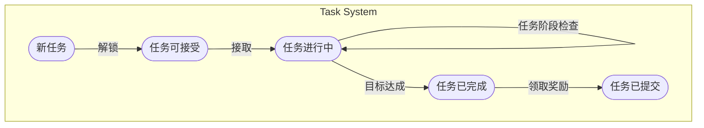

# 任务系统使用手册

[TOC]

## 设计目标

〇、兼容原系统

serverdev中有一个原本的简单任务系统，支持的条件比较简单，任务rpc也只有一个，所以在设计的过程中首先考虑了去兼容原有的任务系统。

一、完全解耦

除Zeze自带的组件外，不依赖任何其他GamePlay的任何数据和逻辑。

二、可扩展性

保证任务系统设计足够灵活，能够比较方便地在已有的框架内增加新的通用内容。

## 架构设计

### 任务组件流程图


### 任务文件组织关系


### 任务的五大状态



1. 状态：新任务。当任务被策划加入到整体的任务表中时，处于新任务状态。新任务会根据角色的具体情况判断，如果符合解锁状态则会自动进入任务可接受状态。
2. 状态：任务可接受。当任务是可接受的，任务会出现在玩家的任务列表上，可以让玩家点一下按钮接受（理论上可以支持NPC对话解锁，但现在还没支持）。按下接受按钮后自动进入任务进行中状态。
3. 状态：任务进行中。进行中的任务允许接受任务事件（Event），如果任务事件被接受则会自动推进任务阶段。
4. 状态：任务已完成。当任务的所有Condition都被做完了以后，进入任务已完成状态。任务完成后需要通过在任务列表点击或者NPC对话等提交任务。
5. 状态：任务已提交。提交任务领取奖励等。当任务处于任务已提交状态，该任务就彻底完成了，将其归档至已完成任务列表。

## Module - TaskBase.Module

### 设计理念

这是一个Task的Module模块，在服务器启动的时候初始化。在任务模块启动前，需要提前加载所有的外部扩展模块（扩展任务/扩展条件）。在模块启动时，加载所有任务的json配置表。

### 内部数据

#### Tasks配置总表：tasks

```java
ConcurrentHashMap<Long, TaskBase<?>> taskNodes
```

这里存放所有Task的实例表。可以在Runtime过程中通过Task的ID查询到配置表，然后将从TaskBean恢复出TaskBase的具体实例。

#### Tasks的构造函数总表：constructors

```java
ConcurrentHashMap<Integer, Constructor<?>> constructors
```

在Zeze外部的应用程序初始化Module的时候，会把所有的通过继承TaskBase的任务类的构造函数注册进Module内。通过反射实现动态扩展。

#### Condition的构造函数总表：conditionConstructors

```java
ConcurrentHashMap<String, Constructor<?>> conditionConstructors
```

在Zeze外部的应用程序初始化Module的时候，会把所有的通过继承ConditionBase的条件类的构造函数注册进Module内。通过反射实现动态扩展。

#### 所有任务的拓扑结构图

```java
DirectedAcyclicGraph<Long, DefaultEdge> taskGraph
```

可以获得每个任务互相的依赖关系，以及检查任务设计是否合法。

### 主要方法

#### 注册所有扩展Task类型

```java
public
    <ExtendedBean extends Bean,
	ExtendedTask extends TaskBase<ExtendedBean>
	> void registerTask(Class<ExtendedTask> extendedTaskClass)
```

在外部扩展组件初始化Module后，要事先将扩展的所有Task类给注册进Module内。这个行为要在`loadJson`之前，否则读取配置的时候`Zeze.TaskBase.Module`还不知道这些扩展的类的构造函数。

#### 注册所有扩展Condition类型

```java
public
    <ConditionBean extends Bean, EventBean extends Bean,
	ExtendedCondition extends TaskConditionBase<ConditionBean, EventBean>
	> void registerCondition(Class<ExtendedCondition> extendedConditionClass)
```

在外部扩展组件初始化Module后，要事先将扩展的所有Condition类给注册进Module内。这个行为要在`loadJson`之前，否则读取配置的时候`Zeze.TaskBase.Module`还不知道这些扩展的类的构造函数。

#### 加载所有任务配置表

```java
void loadJson(String taskJson)
```

指定一个配置表加载任务配表。（目前支持读取json的配置表，其他格式的可以在整个系统外部做一个转换和合法检验的系统）

#### RPC请求处理

```java
long ProcessTriggerTaskEventRequest(TriggerTaskEvent r)
```

中转转发所有的任务rpc事件，推动任务系统前进。

## Abstract Class - TaskBase<ExtendedBean extends Bean>

### 设计理念

`TaskBase`是一个所有**<u>具体任务类型</u>**的抽象任务表。任何使用Zeze的应用程序（如：游戏服务器）通过继承`TaskBase`，并且指定自定义扩展的`ExtendedBean`来实现一个具体的任务类型。

`TaskBase`的设计目标是足够抽象，但也不要将功能过于简化，让程序员用户能够比较便捷地在TaskBase基础中自由地加入新功能模块。

### TaskBase内部数据

#### 位于数据库的持久数据：BTask

TaskBase含有一部分基础的BTask数据，被认为是通常所有任务都必须具备的。

| Bean数据                | 功能                                                         | 数据类型                |
| ----------------------- | ------------------------------------------------------------ | ----------------------- |
| **roleId**              | 当前任务所属的角色Id，角色注册之后才会初始化。有了roleId就可以给ta派奖励等等。 | `long`                  |
| **taskId**              | 任务ID。UNIQUE KEY。由用户配置表提供指定。                   | `long`                  |
| **taskType**            | 任务类型。TaskBase将内置一部分（目前内置`DailyTask`），但也支持外部扩展。 | `string`                |
| **taskState**           | 任务状态。`不可接取`/`可接取`/`已接取未完成`/`已完成未提交`/`已提交（获得奖励）`。 | `int(enum)`             |
| **taskName**            | 任务名。                                                     | `string`                |
| **taskDescription**     | 任务描述。                                                   | `string`                |
| **preTaskIds**          | 前置的任务ID。（通过提供前置任务Id就可以建立整张TaskGraphics，动态扩展起来也方便） | `list<long>`            |
| **currentPhaseId**      | 当前的任务子流程ID。                                         | `long`                  |
| **taskPhases**          | 所有任务子流程表。                                           | `map<long, BTaskPhase>` |
| **<u>extendedData</u>** | 扩展Bean，由ExtendedBean泛型直接指定。                       | `dynamic`               |

但是，BTask只是需要被存进数据库中的数据，并不是所有TaskBase所有的属性。

#### 位于内存的非持久数据：Runtime Data

| Runtime数据      | 功能                                           | 数据类型                                   |
| ---------------- | ---------------------------------------------- | ------------------------------------------ |
| **preTaskIds**   | 前置的所有任务ID。<u>Runtime只读。</u>         | final `ConcurrentHashSet<Long>`            |
| **nextTaskIds**  | 后置的所有任务ID。<u>Runtime只读。</u>         | final `ConcurrentHashSet<Long>`            |
| **currentPhase** | 当前子流程的类实例。                           | `TaskPhase`                                |
| **phases**       | 当前任务含有的所有Phases。<u>Runtime只读。</u> | final `ConcurrentHashMap<Long, TaskPhase>` |

在任务初始化时（比如服务器启动时/通过Bean恢复TaskBase实例时），TaskBase将自动计算这些RuntimeData。

### 扩展需要功能

```java
abstract String getType()
```

新扩展的任务类型必须指定类型。Type字符串用于在json配置表中指定任务的类型。

```java
abstract ExtendedBean getExtendedBean()
```

扩展类需要定义自己的ExtendedBean，并将其赋给`BTask`的内部`DynamicBean`。

```java
abstract boolean isAbleToStartTask()
```

设置任务可接的条件，比如等级、职业等……。如果不满足，则为禁用状态。如果留空直接返回true，则代表这个任务自动可接取。

```java
abstract void onCompleteTask()
```

任务完成时的回调，比如发放奖励等……

```java
abstract void loadJsonExtended(JsonObject json)
```

定义如何为扩展内容解析json文件。

```java
abstract void loadBeanExtended(BTask bean)
```

定义如何为扩展内容解析bean文件。

## Class - TaskPhase

### 设计理念

理论上来说，一个TaskPhase长得和一个Task非常像，几乎绝大部份功能都是可以复用的。比如都可以分别找NPC接，完成之后也可以发奖励。但是区别在于，一个Task通常由很多的小Phase构成的，每个Phase都比较独立。而且每个Phase之间的顺序也是不一定的，可以由任务过程中动态变化。还有，每个Phase都可以由单独的NPC占用，当NPC发生冲突的时候，可以禁止这个Phase的进行。

### TaskPhase内部数据

#### 位于数据库的持久数据：BTaskPhase

| Bean数据              | 功能                                             | 数据类型               |
| --------------------- | ------------------------------------------------ | ---------------------- |
| **phaseId**           | 任务流程ID。UNIQUE KEY。由用户配置表提供指定。   | `long`                 |
| **phaseName**         | 任务Phase名。                                    | `string`               |
| **phaseDescription**  | 任务Phase描述。                                  | `string`               |
| **prePhaseIds**       | 前置的任务Phase的ID。                            | `list<long>`           |
| **nextPhaseId**       | 下一个任务Phase（可动态变化）                    | `long`                 |
| **subPhases**         | 一个Phase的子phase，包含各种条件。可选择ALL或ANY | `mao<long, BSubPhase>` |
| **currentSubPhaseId** | 当前的subphase Id                                | `long`                 |

### SubPhase内部数据

#### 位于数据库的持久数据：BSubPhase

| Bean数据       | 功能                                               | 数据类型               |
| -------------- | -------------------------------------------------- | ---------------------- |
| subPhaseId     | SubPhase流程ID。UNIQUE KEY。由用户配置表提供指定。 | `long`                 |
| completeType   | `ALL` & `ANY`                                      | `string`               |
| nextSubPhaseId | 下一个SubPhase的Id                                 | `long`                 |
| conditions     | 当前SubPhase包含的所有condition                    | `list<BTaskCondition>` |

### 使用指南

（均在json文件中配置）

一个`Phase`可以有众多`SubPhase`。`SubPhase`内存放各种`Condition`，承担的功能非常广泛。

- 比如击杀任务、提交物品任务等，可以放在SubPhase里。如果要任选一个完成则可以把设置成`ANY`。
- 任务完成找NPC对话的交人物行为，也将其视作一个Condition。

## Abstract Class - ConditionBase<ConditionBean extends Bean, EventBean extends Bean>

### 设计理念

一个通用的Condition类，可以很方便地快速扩展。扩展后必须提前注册进`Module`内。

一个新的Condition需要定义一个属性Bean和一个Event Bean。属性Bean内包含了这个Condition的各个属性，Event Bean包含了客户端怎么发Event给这个Condition。

### ConditionBase内部数据

| Bean数据                | 功能                                                 | 数据类型  |
| ----------------------- | ---------------------------------------------------- | --------- |
| **conditionType**       | 条件类型。TaskModule将内置一部分，但也支持外部扩展。 | `string`  |
| **<u>extendedData</u>** | 扩展Bean，由ExtendedBean泛型直接指定。               | `dynamic` |

### 扩展需要功能

```java
abstract String getType()
```

新扩展的条件类型必须指定类型。Type字符串用于在json配置表中指定任务的类型。

```java
abstract void loadJsonExtended(JsonObject json)
```

定义如何为扩展内容解析json文件。

```java
abstract void loadBeanExtended(BTaskCondition bean)
```

定义如何为扩展内容解析bean文件。

```java
abstract boolean accept(Bean eventBean)
```

定义如何接受一个属于该Condition的Event Bean。

```java
abstract boolean isCompleted()
```

定义达成何种条件该Condition才算完成。

## 快速上手

### 一个实际的任务开发场景

模拟一个任务开发的具体场景，来看如何实际对任务系统进行再开发和使用。

#### 目标

新建一个任务，任务共分为三个大流程。

流程一：

> 1. 找NPC（id = 1001）对话接任务，其中有一个【带选项的对话】，有两个可供选择的选项，通过玩家不同的选择会触发不同的任务流程。
> 2. 如果选择选项一，跳到流程二。如果选择了选项二，跳到流程三。

流程二：

> 1. 去往任务指定场景位置（3920, 1850）
> 2. （此时在那里刷出任务专属怪）击杀五只怪物（id=2001），并获得5份怪物材料（id=3001）
> 3. 找NPC（id=1002）对话提交5份怪物材料。
> 4. 对话结束，完成任务

流程三：

> 1. 找NPC（id=1003）对话，获得任务道具（id=4001）。
> 2. 去往指定场景位置（3920, 1850）

针对这个目标，我们可以列出相应的配置表

```json

```

